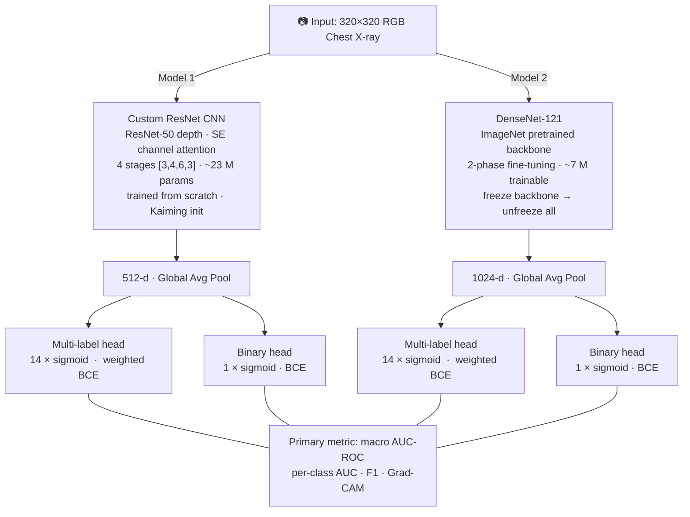
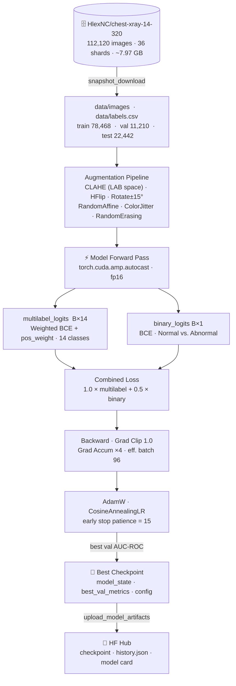

# CheXVision

**Large-Scale Chest X-Ray Pathology Detection** — Deep Learning & Big Data Project

[](https://github.com/arudaev/chexvision/actions/workflows/ci.yml)
[](https://huggingface.co/datasets/HlexNC/chest-xray-14-320)
[](https://huggingface.co/spaces/HlexNC/chexvision-demo)
[](https://www.python.org/)
[](https://pytorch.org/)
[](LICENSE)

---

## Overview

CheXVision tackles **automated chest X-ray pathology detection** at scale using the [NIH Chest X-ray14](https://www.nih.gov/news-events/news-releases/nih-clinical-center-provides-one-largest-publicly-available-chest-x-ray-datasets-scientific-community) dataset — 112,120 frontal-view X-ray images labeled with 14 pathological conditions.

We implement and compare two deep learning approaches on two distinct tasks:

| | Task 1: Multi-Label Classification | Task 2: Binary Classification |
|---|---|---|
| **What** | Detect all 14 pathologies simultaneously | Normal vs. Abnormal screening |
| **Model 1** | Custom ResNet-style CNN (from scratch) | Same backbone, binary head |
| **Model 2** | DenseNet-121 transfer learning (CheXNet) | Same backbone, binary head |

### Why This Matters

- **112,120 images** — true big-data scale requiring efficient data pipelines
- **Medical AI** — directly applicable to clinical decision support
- **CheXNet** (Rajpurkar et al., 2017) — landmark paper achieving radiologist-level performance on this exact dataset
- **From-scratch vs. transfer learning** — rigorous comparison under identical evaluation conditions

---

## Architecture

Both models share the same dual-head design: one forward pass produces both a 14-class multi-label output and a binary normal/abnormal output.



---

## Training Pipeline



---

## Project Structure

```
chexvision/
├── .github/workflows/
│   ├── ci.yml                    # Lint (ruff) + test (pytest) + type check (mypy)
│   └── deploy-space.yml          # Auto-deploy app/ to HF Space on push to main
├── src/
│   ├── data/
│   │   ├── dataset.py            # ChestXrayDataset — PyTorch Dataset, label encoding
│   │   ├── transforms.py         # Train / eval augmentation pipelines
│   │   ├── download.py           # snapshot_download wrapper for HF dataset
│   │   └── resize_320_pipeline.py  # Kaggle kernel: NIH source → 320px parquet shards
│   ├── models/
│   │   ├── scratch_cnn.py        # Model 1: custom residual CNN + SE, dual heads
│   │   └── densenet_transfer.py  # Model 2: DenseNet-121 fine-tuning, dual heads
│   ├── training/
│   │   ├── trainer.py            # Training loop, YAML config merging, history logging
│   │   ├── metrics.py            # AUC-ROC, F1, combine_losses
│   │   └── evaluate.py           # Post-training evaluation and comparison
│   └── utils/
│       ├── hub.py                # HF token resolution, upload_model_artifacts, model card
│       └── visualization.py      # Grad-CAM, ROC curves, training history plots
├── scripts/
│   ├── eda.py                    # EDA — streams metadata from HF, saves plots locally
│   ├── dispatch.py               # Dispatch Kaggle kernels; build + embed project bundle
│   ├── push_models.py            # Manual model upload to HF Hub (recovery path)
│   └── generate_diagram_pngs.py  # Render Mermaid diagrams → PNG via Playwright
├── kaggle/
│   ├── train_scratch/            # Kernel: custom CNN (script.py + kernel-metadata.json)
│   └── train_transfer/           # Kernel: DenseNet-121 (script.py + kernel-metadata.json)
├── configs/
│   ├── default.yaml              # Base hyperparameters inherited by all configs
│   ├── scratch.yaml              # Overrides for custom CNN
│   └── transfer.yaml             # Overrides for DenseNet-121
├── app/
│   └── app.py                    # Streamlit demo — loads models from HF Hub
├── tests/                        # pytest unit tests (51 tests across 9 modules)
│   ├── test_dataset.py
│   ├── test_metrics.py
│   ├── test_transforms.py
│   ├── test_models.py
│   ├── test_hub.py
│   ├── test_download.py
│   ├── test_dispatch.py
│   ├── test_resize_320_pipeline.py
│   └── test_app_bootstrap.py
├── SECURITY.md                   # Vulnerability reporting policy
├── Dockerfile                    # HF Spaces deployment (port 7860, non-root user)
├── requirements.txt              # Runtime deps for Streamlit Cloud / HF Spaces
└── pyproject.toml                # Build config, dev extras, ruff + pytest settings
```

---

## Quick Start

### 1. Clone & Install

```bash
git clone https://github.com/arudaev/chexvision.git
cd chexvision
pip install -e ".[dev]"
```

### 2. Configure credentials

Create a `.env` file at the project root:

```bash
HF_TOKEN=hf_...           # HuggingFace token (read/write)
KAGGLE_API_TOKEN=KGAT_... # Kaggle personal access token (>= 1.8.0 format)
```

### 3. Run EDA (local, no GPU)

```bash
python scripts/eda.py --num-samples 5000 --output-dir results/eda
```

Streams metadata from HuggingFace and generates class distribution / label co-occurrence plots. No GPU or full dataset download required.

### 4. Dispatch Training (Kaggle GPU)

All heavy training runs on **Kaggle GPU kernels** (free T4 GPU, 30 h/week). The dispatch script bundles the entire `src/` tree and `configs/` into a base64 payload embedded directly in the kernel script, so Kaggle always runs exactly what's in your working tree.

```bash
# Push and trigger both training kernels
python scripts/dispatch.py kaggle push scratch
python scripts/dispatch.py kaggle push transfer

# Monitor progress
python scripts/dispatch.py kaggle status scratch
python scripts/dispatch.py kaggle status transfer

# Download output files after completion
python scripts/dispatch.py kaggle output scratch
```

The kernels automatically:
1. Install dependencies
2. Download the pinned dataset snapshot from `HlexNC/chest-xray-14-320`
3. Train the model and save the best checkpoint by validation AUC-ROC
4. Upload the checkpoint, training history JSON, config, and model card to HF Hub

**Prerequisite — one-time setup**: create a **private** Kaggle dataset named `chexvision-secrets` (slug `hlexnc/chexvision-secrets`) containing a single file `hf_token.txt` with your HF token. Both kernel-metadata files declare this dataset as a `dataset_sources` entry, so the token is available in every API-pushed kernel without touching the Secrets UI.

### 5. Run Demo Locally

```bash
streamlit run app/app.py
```

Or visit the live Space: [HlexNC/chexvision-demo](https://huggingface.co/spaces/HlexNC/chexvision-demo)

The app loads trained checkpoints directly from HF Hub — no local files needed. It shows "No trained models available yet" until training completes.

### 6. Manual Model Upload (recovery path)

If training completed but the automated upload failed, use:

```bash
python scripts/push_models.py --checkpoint checkpoints/CheXVision-ResNet_best.pth
python scripts/push_models.py --checkpoint checkpoints/CheXVision-DenseNet_best.pth
```

---

## Dataset

**NIH Chest X-ray14** — hosted at [`HlexNC/chest-xray-14-320`](https://huggingface.co/datasets/HlexNC/chest-xray-14-320)

- **112,120** frontal-view chest X-ray images
- **14 pathology labels**: Atelectasis, Cardiomegaly, Consolidation, Edema, Effusion, Emphysema, Fibrosis, Hernia, Infiltration, Mass, Nodule, Pleural Thickening, Pneumonia, Pneumothorax
- **Multi-label**: each image may have zero or more conditions
- **Binary derived label**: "No Finding" → Normal, any condition → Abnormal
- **Pre-processed**: resized to 320×320 RGB, stored as 36 Parquet shards (~7.97 GB total)

| Split | Images |
|-------|--------|
| Train | 78,468 (70 %) |
| Validation | 11,210 (10 %) |
| Test | 22,442 (20 %) |

---

## Models

### Preprocessing & Training Improvements

Both models share the same input pipeline and training regularisation:

- **CLAHE** (Contrast Limited Adaptive Histogram Equalisation): applied in LAB colour space before any augmentation — enhances local contrast for low-contrast findings (Nodule, Infiltration, Pneumonia) without global brightness shifts
- **Label smoothing** (ε = 0.1): positive targets → 0.9, negative targets → 0.05 — regularises against noisy NIH patient-level labels

### Model 1 — Custom CNN (From Scratch)

A ResNet-50-equivalent architecture built without any pretrained weights:

- **4 residual stages** with depths `[3, 4, 6, 3]` and widths `[64, 128, 256, 512]`
- **Squeeze-Excitation (SE) attention** blocks for channel-wise recalibration
- **Dual heads**: 14-unit sigmoid (multi-label) + 1-unit sigmoid (binary)
- Kaiming initialization; global average pooling before classification heads
- **Loss**: per-label weighted binary cross-entropy (`pos_weight` per class)
- **Optimizer**: AdamW + cosine annealing LR; batch size 24 + gradient accumulation ×4 = effective batch 96

### Model 2 — DenseNet-121 Transfer Learning

Following the CheXNet approach (Rajpurkar et al., 2017):

- **Backbone**: DenseNet-121 pretrained on ImageNet
- **Two-phase fine-tuning**: freeze backbone (epochs 1–5) → full end-to-end fine-tuning (epoch 6+)
- **Dual heads** replacing the original 1000-class classifier
- **Loss**: per-label weighted binary cross-entropy (same as Model 1 for a fair comparison)
- **Optimizer**: AdamW + warm-up + cosine annealing; batch size 24 + gradient accumulation ×4 = effective batch 96

---

## Evaluation

- **Primary metric**: macro-averaged AUC-ROC across all 14 pathologies
- Per-class AUC-ROC, F1, precision, recall
- Binary AUC-ROC and F1 for the normal/abnormal task
- Confusion matrices (binary task)
- **Test-Time Augmentation (TTA)**: averages predictions over 4 views (original, h-flip, rotate ±7°) — reduces variance with zero training cost
- **Ensemble**: averages TTA probabilities from both models — the two architectures fail on different examples, so combining them consistently improves macro AUC
- Grad-CAM heatmaps for qualitative interpretability

---

## Infrastructure

All heavy compute runs in the cloud. Local machines are for editing and lightweight scripts only.

| Component | Platform | Notes |
|-----------|----------|-------|
| Source code | [GitHub](https://github.com/arudaev/chexvision) | CI on every push (lint, test, type check) |
| Dataset | [HF Dataset](https://huggingface.co/datasets/HlexNC/chest-xray-14-320) | 36 Parquet shards · 320×320 · pinned revision |
| Training | [Kaggle kernels](kaggle/) | Free T4 GPU; `dispatch.py` fully automates push |
| Model (scratch) | [HlexNC/chexvision-scratch](https://huggingface.co/HlexNC/chexvision-scratch) | Auto-uploaded by kernel after training |
| Model (transfer) | [HlexNC/chexvision-densenet](https://huggingface.co/HlexNC/chexvision-densenet) | Auto-uploaded by kernel after training |
| Demo | [HF Space](https://huggingface.co/spaces/HlexNC/chexvision-demo) | Auto-deployed by GitHub Actions on push to main |

---

## Development

```bash
# Lint
ruff check src/ tests/ scripts/ app/

# Tests (use CHEXVISION_ALLOW_LOCAL=1 to bypass the cloud-only guard)
CHEXVISION_ALLOW_LOCAL=1 pytest tests/ -v

# Type check
mypy src/ --ignore-missing-imports
```

CI runs all three jobs automatically on every push and pull request.

---

## Security

To report a vulnerability, please use [GitHub Private Security Advisories](https://github.com/arudaev/chexvision/security/advisories/new). See [SECURITY.md](SECURITY.md) for the full policy.

---

## Team

**BIG D(ATA)** — Deep Learning & Big Data, AIN program

---

## References

1. Wang, X. et al. (2017). "ChestX-ray8: Hospital-scale Chest X-ray Database and Benchmarks." *CVPR*.
2. Rajpurkar, P. et al. (2017). "CheXNet: Radiologist-Level Pneumonia Detection on Chest X-Rays with Deep Learning." *arXiv:1711.05225*.
3. Huang, G. et al. (2017). "Densely Connected Convolutional Networks." *CVPR*.
4. He, K. et al. (2016). "Deep Residual Learning for Image Recognition." *CVPR*.
5. Hu, J. et al. (2018). "Squeeze-and-Excitation Networks." *CVPR*.

---

## License

MIT — see [LICENSE](LICENSE) for details.
